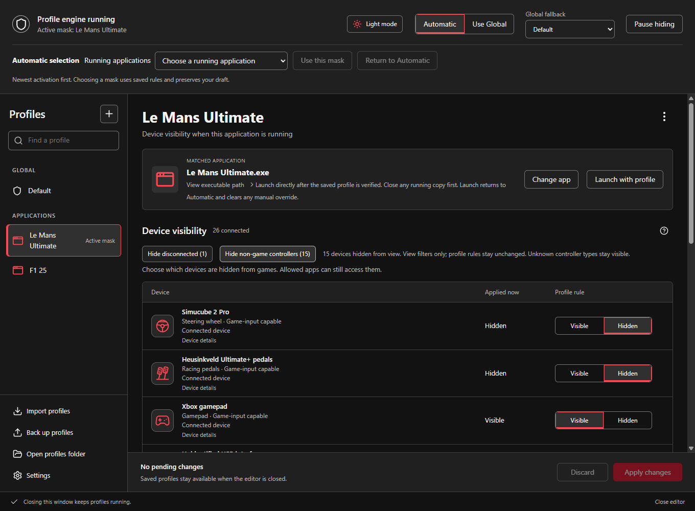
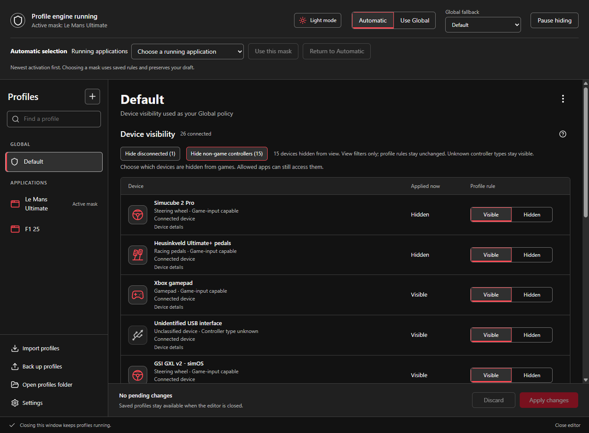
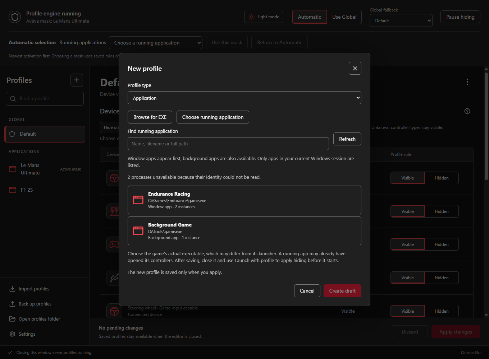
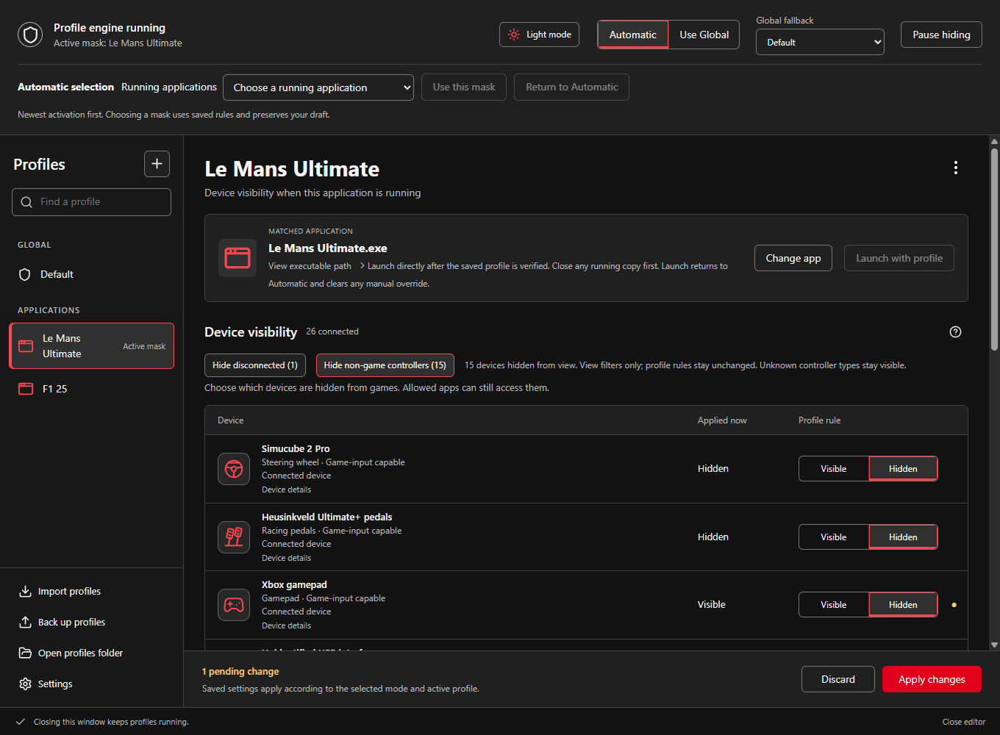

# HidHide Profiles

One Windows 11 x64 setup for profile-based HidHide configuration, its resident profile coordinator, CLI, and the unchanged Microsoft-signed upstream driver. The unified package is undergoing release validation; see [current status](docs/unified-package-progress.md), [installation layout](INSTALL_LAYOUT.md), and [build instructions](BUILD_AND_RELEASE.md).

<picture>
  <source media="(prefers-color-scheme: light)" srcset="docs/images/editor-application-profile-light.png">
  
</picture>

## Introduction

*Microsoft Windows* offers support for a wide range of human interface devices, like joysticks and game pads.
Associating the buttons and axes of these devices with application specific behavior, such as *Fire*, *Roll*, or *Pitch*
is however left to the individual application developers to realize.

While there are good examples of applications allowing a user to customize the controls to their liking, other
applications are less sophisticated or lack just that feature a user is looking for. This is where utilities like *vJoy*
and *Joystick Gremlin* come to the rescue. These utilities aren't limited by a vendor lock-in and attempt to move
certain features back into the domain of the operating system. Once properly arranged, a feature becomes
universally available for a wide range of applications.

A technique used by these utilities is to use a feeder application that listens to the physical devices on a system,
and in turn controls one or more virtual devices where the game or application is listening to. Mapping physical
devices to a virtual device allows for e.g. dual joystick support in games that only support a single joystick, or
enable multiple devices to bind to the one and same function in a game that only supports single controller bindings.

While this approach offers a lot of advantages, it also comes with a side effect. Most applications record the user
interactions while binding a function with a control or button press. When a virtual device is used, the application
receives input from two devices simultaneously. It will be notified by both the physical device triggered, and the
virtual device that acts in turn! Some feeders have an option to spam the application repeatedly; however, that approach is
cumbersome and error prone.

With *HidHide* it is possible to deny a specific application access to one or more human interface devices, effectively
hiding a device from the application. When a HOTAS is preferred for a flight-simulator one can hide the game pads.
When a steering wheel is preferred for a racing game, one can hide the joysticks, and so on. When, as mentioned
above, a feeder utility is used, one can use *HidHide* to hide the physical device from the application, hence avoiding
multiple notifications while binding game functions and device controls.

## Package content

The public MSI contains `HidHideClient.exe`, `HidHideCLI.exe`, app-local runtimes and the verified driver package under `%ProgramFiles%\HidHide\`. Standard Windows Installer dialogs manage installation, repair and removal and present one Installed Apps entry. Start the MSI normally and approve elevation when requested; the configuration utility runs without elevated rights. Existing companion-only instructions are superseded.

## User guide

### How profiles work

A profile says which devices are hidden. There are two kinds:

- **Global** profiles apply when no application profile is running. A fresh install creates an all-Visible *Default*.
  The **Applied now** column shows what the driver is doing at the moment, so here it reports the wheel and pedals as
  Hidden, because a running application profile is in charge.

  

- **Application** profiles are tied to one exact executable. While that game runs, its rules replace the Global
  profile. When it exits, the previous mask comes back. The card at the top shows the matched executable and offers
  **Launch with profile**, which applies and verifies hiding *before* the game starts.

Create an application profile with the **+** button. Browse for the game's executable or pick it from the
applications that are running now:



Edits are drafts until you **Apply changes**. The dot beside a row and the pending-change bar show what will change,
and **Applied now** keeps showing the driver's real state until the edit is saved and applied:



The view filters (**Hide disconnected**, **Hide non-game controllers**) only shorten the list; they never change
profile rules. The details of activation order, pinning and launching follow.

### Reference

Profiles are the configuration utility's main workspace. Each saved profile is a complete visibility
policy: devices default to Visible, and exact device identities can be marked Hidden
or explicitly Visible. Application profiles activate only for an exact verified
executable path and process lifetime. In Automatic, the most recently activated
still-running application profile supplies the single global mask. A starts, then
B, then C: C wins; closing C restores B, closing B restores A, and closing A restores
the selected Global. Additional instances do not promote a profile. Same-scan
activations use process creation time, then priority and stable ID for ties.
Editing, refreshing, or focusing a window never promotes a profile.

The **Active mask** chooser lists running profiles newest first. **Use this mask**
pins the saved mask until **Return to Automatic**, the application's last process
exits, or its saved eligibility changes. New applications continue entering the
history under a pin. Use Global and Pause clear the pin while history continues.
Pins and activation order are runtime only; restarting the engine reconstructs order
from running process creation times. Selecting a profile row only opens its detached
editor. Runtime mask commands preserve unsaved drafts; **Apply changes** saves edits.

The signed driver remains machine-global, so the effective profile affects every
non-whitelisted application. Allowed apps are a global exemption managed alongside
repository settings; feeder utilities that need to read hidden physical devices must
remain allowed. **Pause hiding** saves a mode in which device hiding is disabled;
**Resume** applies the selected policy again. The UI distinguishes Saved from Applied
and reports unknown readback or external driver conflicts without calling requested
state verified.

Profiles and settings live in the initiating user's `%LOCALAPPDATA%\HidHide Profiles\Profiles`
repository. A fresh install creates an all-Visible Default Global. The new catalog
does not migrate or depend on the legacy `ConfigurationV1` registry value, and CLI
profile mutation commands are intentionally unavailable so there is one Apply/CAS
writer boundary. Closing the window keeps the coordinator in the same
`HidHideClient.exe` process running in the notification area; tray Exit restores the
verified baseline or retains driver-only recovery evidence when restoration cannot
be confirmed.

Automatic detection is best effort. It does not guarantee that hiding is applied before a game opens a device, or that
already-open handles lose access. Read-only CLI queries do not automatically whitelist the CLI executable.

For reliable hiding at application startup, configure and Apply the complete Global
profile, select **Use Global**, verify it is active, and then start the game. Alternatively,
save an enabled application profile and use **Launch with profile** in its editor card:
the ordinary-user coordinator starts that exact executable suspended, applies and reads
back its complete policy, then resumes it as an ordinary new activation. Launch
returns to Automatic and clears a manual override; newer applications can replace
its mask, and fallback includes every still-running application. It rejects an already-running
target because existing handles may remain usable. Keep the game out of Allowed
apps, and keep feeder utilities that must read
physical devices in Allowed apps. Merely applying an inactive application profile saves
it; that does not put its device policy in force before an external launch. The profile
policy replaces the former permanent Devices selection; there is no second device policy
to combine with it. Reconnect devices after configuration changes when the UI directs it.

The coordinator uses coalesced process scans while enabled application profiles can
match, including Use Global and Pause, stops when no enabled applications exist, and posts only
semantic changes to the UI. Its scan interval is not a deadline: scheduling,
configuration dialogs, and errors can delay application of a detected profile. Starting the
manager first, automatic sign-in startup, or a profile showing *Running* does not establish that hiding preceded a game's
first device open. The signed driver checks access at device-open time and does not revoke already-open handles.
An application that opened a controller before hiding took effect can therefore retain access. Close that application,
verify the required Global policy or use **Launch with profile**, and then start it again;
waiting for detection does not repair an existing handle. The direct launch action does
not cover a launcher that hands off to another process, a child after its parent exits,
or a game started elsewhere. It launches the saved executable without extra arguments.
Successful launches allow normal profile edits and multiple launched applications.
Setup maintenance remains blocked while an owned launched process is alive. An
uncertain launch failure conservatively holds the last policy until that process
exits. Tray Exit restores baseline and stops monitoring. Restart reconstructs
automatic selection; it cannot repair handles already opened by a running game.

This activation contract is based on source inspection and isolated process fixtures,
not live verification against an installed signed driver.
The [manual validation procedure](testing/app-profile-activation.md) covers startup ordering and retained handles;
validation on the supported installed signed driver remains outstanding.

Connected devices and remembered disconnected exact identities remain editable.
Friendly names are display-only and never transfer a rule to another device.

## Package integration

The unchanged upstream driver exposes the following registry keys; these are distinct from unified installer registration.
*"HKCR\Installer\Dependencies\NSS.Drivers.HidHide.x64\Version"* signals the availability of HidHide and its version.
*"HKCR\SOFTWARE\Nefarius Software Solutions e.U.\Nefarius Software Solutions e.U. HidHide\Path"* tells its location.

Third-party software deployment may benefit from the *HidHide Command Line Interface (CLI)* while deploying software.
Please be conservative while altering a clients' configuration and only extend the configuration with new features offered.
Don't assume exclusive ownership of the configuration settings as a recovery typically requires manual actions by the user.

See [DEVELOPER.md](DEVELOPER.md) for programmatic integration (IOCTL API) details for feeder applications.

## Bugs & Features

~~Found a bug and want it fixed? Feel free to open a detailed issue on the [GitHub issue tracker](../../issues)!~~

There is currently no capacity for any major works on HidHide, if you wish to see this change, consider contributing.

Contact us [through Discord](https://discord.nefarius.at/)!

---

The HidHide driver provides both logging and tracing. Logging can be found the *Event Viewer* under *Windows Logs* and *System*.
Tracing can be found under *Applications and Services Logs* and *Nefarius* after enabling *Show Analytic and Debug Logs*.
Extended tracing is available but switched off per default for performance reasons. Tracing is controlled using the *wevtutil* utility
which is an integral part of the operating system. To enable extended tracing, open a command shell, and enter the following;

```cmd
wevtutil set-log Nefarius-Drivers-HidHide/Diagnostic /e:false
wevtutil set-log Nefarius-Drivers-HidHide/Diagnostic /k:5
wevtutil set-log Nefarius-Drivers-HidHide/Diagnostic /e:true
```

Tracing adjustments remain in affect after a reboot. Restore tracing to its default level using the above sequence with /k:1 instead.
Tracing to the debug console is enabled with /k:3 and /k:7 respectively.

## Questions & Support

Please respect that the GitHub issue tracker isn't a help desk. [Look at the community support resources](https://docs.nefarius.at/Community-Support/).

## Donations

> From creator Eric

Creating a utility like this requires time and dedication. Should you like to express your gratitude, consider a pledge
for a game I'm rather fond of; the biggest crowd funded game currently in development *Star Citizen*. Be sure to apply a
referral code at account creation as it gives a bit more in-game currency and can't be applied later on. My referral code
is *STAR-K6S5-KPY7* should you seek one. Have fun and see you in the verse!

> From maintainer Nefarius

You can find all my donation options [over here](https://docs.nefarius.at/Donations/)!
